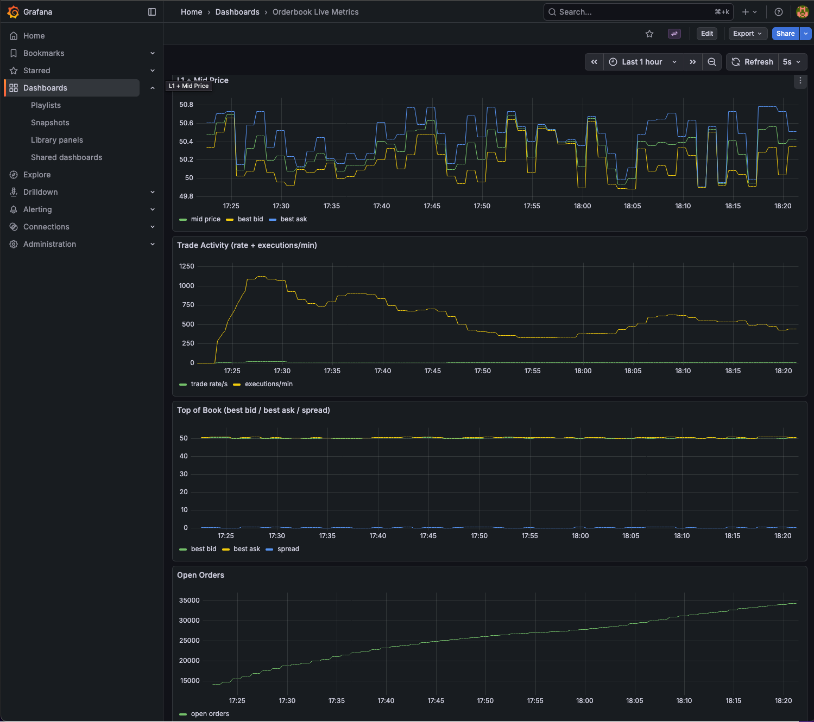

# LOB Matching Engine

## How the System Operates (End-to-End)

1. The stack runs on a **local Kubernetes cluster** (Docker VM + Helm/Kubectl).
2. **Kafka (Bitnami)** provides asynchronous communication between services.
3. **Kafka-init** creates/configures required topics and startup state.
4. **Traderpool** services generate and publish buy/sell limit orders.
5. The **Matching Engine** consumes orders, updates the in-memory LOB, matches compatible orders, and emits resulting market events.
6. Consumers/scripts can subscribe to those events for observation and visualization.

In short: traders publish orders -> matching engine processes LOB state -> matched outcomes and prices are published back through Kafka.

## Components

- **Kafka (Bitnami):** async event bus between engine and traders
- **Kafka-init:** one-time job for topics/config of kafka
- **Matching Engine (Go):** orderbook data structure + matching logic
- **Traderpool (Go):** order generators/participants
- **Grafana:** live monitoring and dashboards

## Structures
### Orderbook

The `Order` supports create and cancel flows (`BUY` / `SELL` / `CANCEL`).
```
type Order struct {
	OrderID   string
	OrderType string
	Price     float64
	Quantity  uint64
	Action    string
	Timestamp int64
}
```

The matching engine publishes trades and mid-price updates as:
```
type Trade struct {
	TradeId   string
	OrderId   string
	Quantity  uint64
	Price     float64
	Action    string
	Status    string
	Timestamp int64
}

type PricePoint struct {
	Price float64
}
```

The Orderbook is the actual data structure holding the orders ready to be filled. Main operations in a matching engine are
- place order
- get volume at price
- cancel/delete by `order_id`

```
type Orderbook struct {
	BestBid            *MaxHeap
	BestAsk            *MinHeap
	PriceToVolume      map[float64]float64
	openOrderCount     int
	PriceToBuyOrders   map[float64]*OrderQueue
	PriceToSellOrders  map[float64]*OrderQueue
	OrderIDToRef       map[string]OrderRef
}

type OrderRef struct {
	Action string
	Price  float64
}
```

## Local Cluster

### Dependencies

The local cluster requires some dependencies. Following commands are for macos, adapt to your OS.
```
brew install docker
brew install helm
brew install kubectl
```

### Build

This step builds all images for the various services of the order book stack which for now contains:
- kafka_init
- matching engine service
- trader pool service

```
make build
```

### Helm

This step leverages helm for kafka stack component
```
make helm
```

### Start

Star the whole infrastructure and run the services
```
make start_deps
make start
```

### Monitoring (Prometheus + Grafana)

Install order (single host, local cluster):
```
make helm
make build
make start
```

If you prefer explicit monitoring install:
```
make monitoring-up
```

Port-forward:
```
kubectl -n monitoring port-forward svc/grafana 3000:80
kubectl -n monitoring port-forward svc/prometheus-server 9090:80
```

Grafana credentials:
- Local default from values: `admin` / `admin`
- Retrieve from Kubernetes secret:
```
kubectl -n monitoring get secret grafana -o jsonpath='{.data.admin-user}' | base64 --decode; echo
kubectl -n monitoring get secret grafana -o jsonpath='{.data.admin-password}' | base64 --decode; echo
```

Dashboard validation:
- Open Grafana at `http://127.0.0.1:3000`
- Open dashboard `Orderbook Live Metrics`
- Confirm the 3 panels update while traderpool is producing orders:
	- `Mid Price`
	- `Trade Activity (rate + executions/min)`
	- `Top of Book (best bid / best ask / spread / open orders)`

## Dashboard

